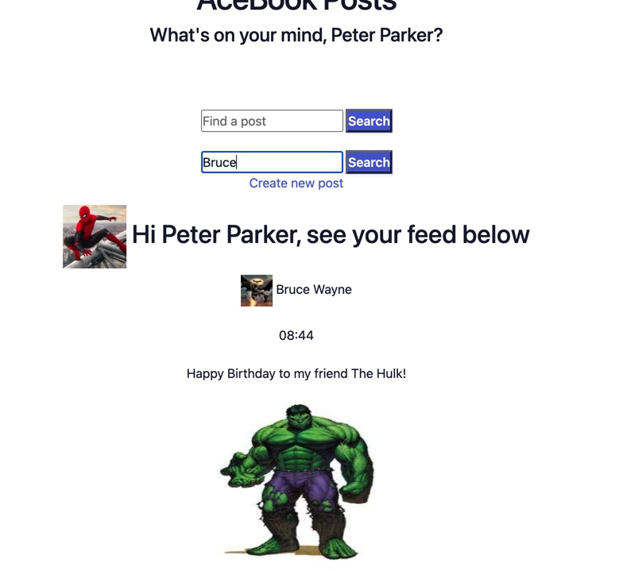

## About the Project

This is a Facebook clone made as part of the Makers Academy.

This site allows users sign up, login, create Photo posts with text, Like/Unlike posts and add comments to posts. Further details are shown below. 

Created from start to finish in 2 weeks using [Ruby on Rails](https://rubyonrails.org/) with [SQLite](https://www.sqlite.org/index.html) being used as the database.

## Getting Started

### Prerequisites 

- [Ruby 3.0.2](https://www.ruby-lang.org/en/documentation/installation/)
- [RVM](https://rvm.io/)
- [Bundler](https://bundler.io/)
- [Node](https://nodejs.org/en/)

### Installation

1. Make sure prerequisites are installed.
2. Clone the repo.

````
git clone https://github.com/chris-clement/acebook-betterverse.git
````
3. cd into the directory.

````
cd acebook-betterverse
````

4. Ensure you use version 3.0.2 of Ruby.

````
rvm 3.0.2
````

5. Install Gemfile packages.

````
bundle install
````

6. Create the databases.

````
bin/rails db:create
bin/rails db:migrate
````

7. Run the server.

````
bin/rails server
````

8. Visit the locally hosted website.

````
bin/rails db:create
bin/rails db:migrate
````

### What you should see


### Testing

Tests use [RSpec](https://rspec.info/)


````
bundle exec rspec
````

All tests should pass.

## Usage

### Signing Up

Fill in your details on the sign up page. Checks are in place that the email is not already in use and the password is an appropriate length. 


### Logging In

After succesfully signing up, login with your details.


This will take you to your feed page.


### Create a Post

Let's create a Post. Click on Create new post.


It now appears on your feed.


### Comment on a Post

You can comment on any Post.


### Like a Post

You can also Like and subsequently unlike a post if you change your mind.


### Edit/Delete

Note in the above screenshots every post you make can be edited/deleted. This is the same for comments.

There are controls in place to ensure you cannot edit/delete other people's comments/posts.


### Search for Posts

Once your feed has many posts you can search for a specific post which will filter the results.


### Search for Friend's Posts

You can search for a Friend's Posts based on their name. For instance if I wanted to see all of Bruce's posts I would search like the below. 




### Profile Page

Click on your profile in the Nav Bar to access a summary of your total number of posts and received likes. It also filters for all of your own Posts.


